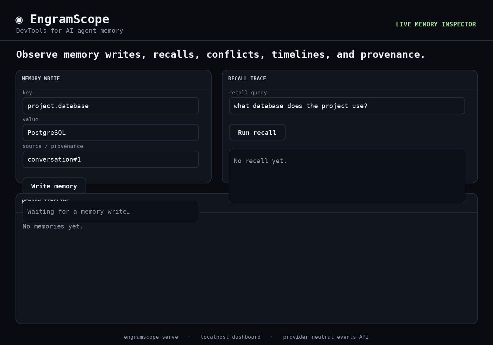

# ◉ AgentMemora

**Open-source DevTools for AI agent memory.**

> See what your agents remember, why they recall it, and when memory goes wrong.

<p align="center"></p>
<p align="center"><strong>Write → Recall → Trace → Detect conflict → Explain</strong></p>

AgentMemora gives AI-agent developers a local, framework-agnostic way to inspect **memory writes, recall traces, conflicts, timelines, latency, and provenance**. It sits beside memory systems such as Mem0, Graphiti, Cognee, LangMem, and Hindsight — it does not replace them.

**Memory is application state. It should be observable, testable, and debuggable.**

## Why AgentMemora?

When an agent produces a wrong answer, the failure may be the model, prompt, RAG pipeline, tool output — or bad memory. AgentMemora makes memory behavior inspectable: what was stored, where it came from, what was recalled, why it ranked, when facts changed, and how external providers behaved.

## Quick start

```bash
python -m venv .venv
source .venv/bin/activate
pip install -e '.[dev]'
agentmemora serve
```

Open `http://127.0.0.1:8765`. Write `project.database = PostgreSQL`, update it to `MongoDB`, then run recall. The dashboard shows the conflict, historical timeline, recall reason, and provider operation events.

## Python SDK

```python
from agentmemora import AgentMemora

lens = AgentMemora("agentmemora.db")
lens.remember(key="project.database", value="PostgreSQL", source="conversation#23", confidence=0.94)
lens.remember(key="project.database", value="MongoDB", source="conversation#41")

for hit in lens.recall("what database does the project use?"):
    print(hit.memory.value, hit.score, hit.reason)
```

## Observe existing memory systems

AgentMemora records provider-neutral operation events around existing memory systems. **Raw external-provider memory payloads and search queries are not persisted by default.** Payload capture is explicit opt-in for controlled development environments.

### Mem0

```python
from mem0 import MemoryClient
from agentmemora import AgentMemora
from agentmemora.adapters import ObservedMem0

lens = AgentMemora("agentmemora.db")
mem0 = ObservedMem0(MemoryClient(api_key="..."), lens)
mem0.add([{"role": "user", "content": "I prefer VS Code"}], user_id="alice")
mem0.search("preferred editor", user_id="alice")
```

No credentials needed for the demo: `python examples/mem0_reproducible.py`.

### LangGraph / LangMem

```python
from langgraph.store.memory import InMemoryStore
from agentmemora import AgentMemora
from agentmemora.adapters import ObservedLangGraphStore

lens = AgentMemora("agentmemora.db")
store = ObservedLangGraphStore(InMemoryStore(), lens)
store.put(("memories", "alice"), "pref-1", {"text": "I prefer dark mode"})
store.search(("memories", "alice"), query="theme preference", limit=5)
```

See `examples/langgraph_observed.py`. Custom stacks can POST provider-neutral events directly to `/v1/events`.

## What v0.1 includes

- Memory Inspector and provenance
- Conflict detection and historical timelines
- Explainable recall traces
- Provider-neutral Events API
- Mem0 adapter with privacy-safe defaults
- LangGraph/LangMem store adapter
- Provider/operation filters and latency in the dashboard
- REST API and zero-build local dashboard
- Python 3.10–3.13 CI matrix

## API

```bash
curl -X POST http://127.0.0.1:8765/v1/memories \
  -H 'content-type: application/json' \
  -d '{"key":"user.editor","value":"VS Code","source":"conversation#12","memory_type":"preference","confidence":0.97}'

curl 'http://127.0.0.1:8765/v1/recall?q=editor'
curl 'http://127.0.0.1:8765/v1/events?provider=mem0&operation=recall'
```

## Architecture

```text
Agent / App
    |
    +--> Mem0 ------------------+
    +--> LangGraph / LangMem ---+--> AgentMemora operation events
    +--> Custom memory ---------+        |
                                         +--> latency / namespace / summaries
                                         +--> DevTools UI / API

AgentMemora reference store ---> conflicts / timeline / recall trace
```

## Roadmap

AgentMemora is building toward a **vendor-neutral observability + evaluation layer for agent memory**. Next: Graphiti/OpenAI Agents adapters, memory diff/rollback, temporal benchmarks, JSONL export, PII/secret hooks, poisoning signals, and regression checks.

See [ROADMAP.md](docs/ROADMAP.md).

## Contributing

Real agent-memory failure cases, provider adapters, benchmark scenarios, dashboard improvements, and security checks are welcome. See [CONTRIBUTING.md](CONTRIBUTING.md).

## Philosophy

**Memory should be observable, testable, and reversible.**

## License

MIT
