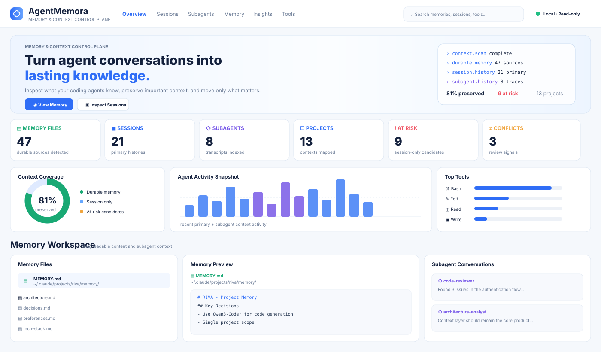

# ◉ AgentMemora

**Memory & Context Control Plane for AI Coding Agents.**

> Inspect what your agents know. Preserve important context. Move it between sessions, machines, and agents.

<p align="center"></p>

AgentMemora is a **local-first memory intelligence layer** for coding agents. It reads the state your tools already create — session transcripts, auto-memory, project instructions, rules, and runtime memory events — and turns it into a control plane for **inspection, curation, preservation, and transfer**.

It is deliberately **not another memory database** and it is not primarily a token/tool analytics dashboard.

```text
Session history          Durable memory           Project context
Claude JSONL             Auto memory              CLAUDE.md / AGENTS.md
      |                       |                         |
      +-----------------------+-------------------------+
                              |
                    AgentMemora Intelligence
                              |
             +----------------+----------------+
             |                |                |
       Context risks      Conflicts       Context Capsules
             |                |                |
             +-------- Curate / Preserve / Transfer ----+
```

## One command

Prerequisite: Node.js 20+.

After the npm alpha is published:

```bash
npx -y agentmemora@latest
```

Until then, run the current GitHub build:

```bash
npx --yes --package=github:hailneed/agentmemora agentmemora
```

The dashboard opens on `127.0.0.1:8765`. Vendor session logs are read-only. There is no telemetry.

## What makes AgentMemora different

AgentMemora focuses on the questions that appear after an agent has worked with you for a while:

- What does this agent currently know about my project?
- Which important decisions exist only inside an old session?
- What may disappear when I start a fresh session or compact context?
- Do memory files disagree with each other?
- Which repeated user corrections should become durable memory?
- How do I continue the exact session, fork it, or carry only the useful context forward?
- How do I move selected context without copying an entire raw transcript?

Session/tool/model statistics remain available as supporting evidence, but **memory lifecycle is the product center**.

## Memory Intelligence

AgentMemora currently combines supported durable sources with Claude Code local session history and produces a **Memory Posture** view:

- durable memory and instruction inventory
- session-only memory candidates
- context-loss risk candidates
- conservative `key: value` conflict detection across durable sources
- stale memory detection (90+ days)
- provenance for every source
- session → memory coverage estimate
- exact-session Resume and Fork commands
- deterministic Context Capsule export

Candidate/risk detection is intentionally heuristic and is labeled as such. AgentMemora does not pretend that a regex is semantic truth.

The default dashboard is organized as a compact developer tool rather than a generic analytics platform: top navigation, visual memory/session/subagent posture, recent context activity, then a **Memory Workspace** where durable files, readable content, provenance, and subagent conversation excerpts sit side by side. Tool/model analytics stay lower in the page as supporting telemetry.

## Context Capsules

A Context Capsule is a portable Markdown handoff extracted from a local session. It contains provenance, user intent/constraints, recent working state, and a tool footprint while intentionally excluding raw tool results.

Create one from the CLI:

```bash
agentmemora capsule --session <session-id> --output project-context.md
```

Or use **CONTEXT CAPSULE** on a session card in the dashboard.

A capsule is designed for a fresh Claude/Codex/Cursor session, another machine, a teammate, or an archived project handoff. It is **not** a byte-for-byte vendor session migration.

## Resume vs Fork vs Transfer

For Claude Code sessions AgentMemora exposes three distinct workflows:

```text
Resume   -> continue the exact saved conversation
Fork     -> copy conversation history into a new branch/session
Transfer -> create a clean portable Context Capsule
```

The dashboard gives copyable commands for the first two and a downloadable capsule for the third.

## Guarded memory curation

AgentMemora never edits Claude Code JSONL transcripts. Those are treated as vendor-owned history artifacts.

For explicit memory/instruction files, curation is opt-in and guarded:

```bash
agentmemora promote \
  --target ~/.claude/projects/<project>/memory/MEMORY.md \
  --text "- Use pnpm for this project" \
  --yes
```

Or promote a reviewed capsule/file:

```bash
agentmemora promote \
  --target ~/.claude/projects/<project>/memory/MEMORY.md \
  --from reviewed-memory.md \
  --yes
```

Before an existing target is modified, AgentMemora writes a backup into a sibling `.agentmemora-backups/` directory. Without `--yes`, the write is refused. Targets are restricted to recognized memory/instruction paths such as `MEMORY.md`, `CLAUDE.md`, and `memory/` / `memories/` directories.

## Supported local state today

### Claude Code

- `~/.claude/projects/**/*.jsonl` session transcripts
- `~/.claude/projects/<project>/memory/**/*.md` auto memory
- `CLAUDE.md`
- primary session vs subagent distinction
- prompts, readable assistant text, tool names, model/token metadata
- Resume/Fork command generation
- Context Capsule export

### Other context surfaces

- `AGENTS.md`
- `GEMINI.md` and `~/.gemini/GEMINI.md`
- `.github/copilot-instructions.md`
- `.github/instructions/**/*.instructions.md`
- `$HOME/.copilot/...`
- `.cursor/rules/**`
- `$CODEX_HOME/memories/**` (default `~/.codex/memories/**`)
- generic explicit `MEMORY.md`

AgentMemora does **not** blindly crawl the computer. It does not intentionally scan `.env`, SSH keys, browser credential stores, keychains, or arbitrary documents.

## Commands

```bash
# Full control-plane dashboard
agentmemora

# Select an additional workspace
agentmemora scan --path /path/to/project

# Focus on Claude session inventory
agentmemora sessions

# Export selected session context
agentmemora capsule --session <id> --output context.md

# Curate reviewed text into durable memory (backup + explicit confirmation)
agentmemora promote --target <MEMORY.md> --text "..." --yes

# Environment/safety check
agentmemora doctor
```

## Why session context matters

A saved session and durable memory are different things. Claude Code stores local conversations as JSONL under `~/.claude/projects/`; a fresh session starts with a fresh conversation context, while persistent instructions/auto-memory can be loaded again. AgentMemora makes that boundary visible instead of treating every artifact as the same kind of “memory.”

That enables a useful workflow:

```text
Discover -> Understand -> Curate -> Preserve -> Transfer -> Resume anywhere
```

## Live memory observability

The existing Python SDK remains available for advanced runtime instrumentation beside systems such as Mem0 and LangGraph/LangMem.

```python
from agentmemora import AgentMemora

lens = AgentMemora("agentmemora.db")
lens.remember(key="project.database", value="PostgreSQL", source="conversation#23", confidence=0.94)
lens.remember(key="project.database", value="MongoDB", source="conversation#41")

for hit in lens.recall("what database does the project use?"):
    print(hit.memory.value, hit.score, hit.reason)
```

Raw external-provider payloads/search queries are not persisted by default.

## Safety model

- local-first
- dashboard binds to `127.0.0.1`
- no telemetry by default
- vendor session JSONL is read-only
- no blind home-directory crawl
- memory mutation requires an explicit target + `--yes`
- existing memory is backed up before modification
- Context Capsules exclude raw tool results by default

## Development

```bash
npm run test:node
node ./bin/agentmemora.js --no-open
node ./bin/agentmemora.js sessions --no-open
```

Python SDK:

```bash
python -m venv .venv
pip install -e '.[dev]'
pytest -q
```

## Roadmap

Next: reviewed candidate → memory promotion from the UI, semantic conflict analysis, selective Context Surgery, cross-agent capsule adapters, memory diff/rollback, secret/PII redaction hooks, and memory regression checks.

See [ROADMAP.md](docs/ROADMAP.md).

## Philosophy

**Agent context is working state. Important state should be inspectable, preservable, portable, and under the developer's control.**

## License

MIT
